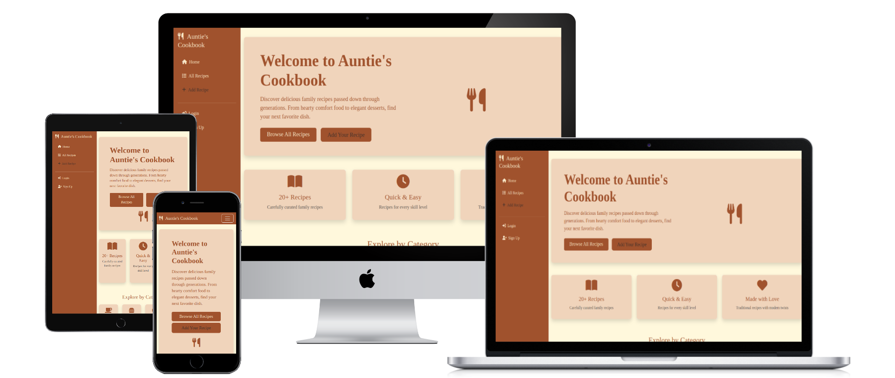
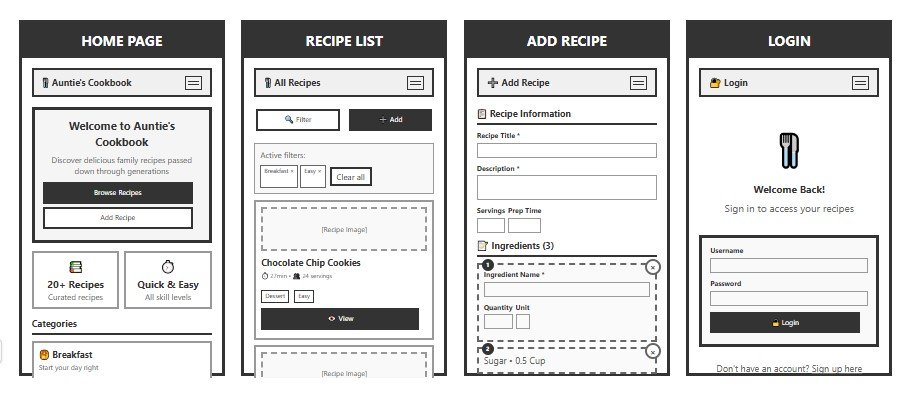
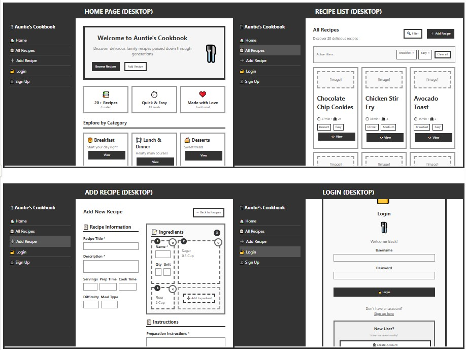
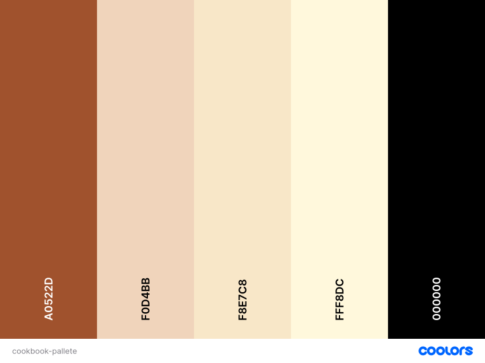

# Auntie's Cookbook

A Django-based recipe management application where users can create, share, and discover recipes. Built as my Milestone Project 3 for the Code Institute Full Stack Development course.



**[View Deployed Live Project](https://aunties-cookbook-1fa7efd3561a.herokuapp.com/)**

## Table of Contents

- [Project Overview](#project-overview)
- [User Experience (UX)](#user-experience-ux)
- [Features](#features)
- [Technology Stack](#technology-stack)
- [Database Design](#database-design)
- [Testing](#testing)
- [Deployment](#deployment)
- [Credits](#credits)

## Project Overview

This is a recipe sharing platform built with Django. Users can browse recipes without an account, but need to register to add their own recipes. Each recipe includes ingredients, cooking instructions, prep/cook times, and difficulty levels. The site includes filtering options to help users find recipes by meal type, difficulty, or dietary requirements.

### Project Goals

- Create an intuitive platform for recipe discovery and sharing
- Implement full CRUD (Create, Read, Update, Delete) functionality for recipes
- Provide advanced filtering and categorization options
- Ensure responsive design across all device types
- Maintain secure user authentication and authorization

### User Stories

#### Recipe Submission and Management
As a **Chef/User** I can **submit my own recipes to the cookbook** so that **I can share my culinary creations with the community.**
- A registered user can access a "Submit/Add Recipe" form with fields for title, description, ingredients, instructions, categories, photos, etc.
- The submitted recipe shouldn't need to be reviewed by an administrator before being published live on the website.
- Users can edit and delete their own submitted recipes after publication.

#### Public Recipe Access
As a **Guest User** I can **browse and view all publicly available recipes** so that **I can explore the website's content before deciding to register.**
- All recipe pages and search functionalities are accessible without requiring a login.
- The website clearly indicates features that require registration (e.g., adding recipes shows a "Login Required" prompt).
- Recipe details, ingredients, and instructions are fully visible to all visitors.

#### Recipe Discovery and Browsing
As a **Guest/User** I can **browse recipe lists posted by users** so that **I can find the type of recipe I'm looking for.**
- All recipes should be displayed in a list presented in a card view (listed view to be considered in future updates).
- Recipe filtering functionality is implemented to aid searching by meal type, difficulty, and dietary restrictions.
- Pagination ensures smooth browsing experience when many recipes are available.

#### User Authentication and Account Management
As a **Future/Current user** I can **create or login to an account** so that **I can create, delete, and manage recipes.**
- A new user can successfully register an account by providing required information (username, password) and is then logged in and directed to the homepage.
- An existing user can successfully log in using their registered credentials and gain access to user-specific features.
- The system provides clear error messages for invalid login attempts (e.g., incorrect password, unregistered username) or during account creation (e.g., username already in use, password requirements not met).

#### Responsive Design and Navigation
As a **Chef/User** I can **easily navigate the website** on my personal computer as well as mobile device.
- Responsive design functions seamlessly on larger and smaller screen sizes.
- Intuitive and easy-to-use interface with clear navigation elements.
- Mobile-optimized features including collapsible menus and touch-friendly interactive elements.
## Wireframes

<details>
<summary>Mobile Wireframes - Click to open</summary>



</details>

<details>
<summary>Desktop Wireframes  - Click to open</summary>



</details>

<details>
<summary>Tablet Wireframes - Click to open</summary>


</details>

## Design Philosophy

The design uses warm, earthy colors to create a cozy, kitchen-like feel. I chose browns and creams to make it feel welcoming and homey, like flipping through a well-loved family cookbook.

#### Color Palette





- **Primary Color**: `#A0522D` (Sienna) - For headers and main elements
- **Secondary Color**: `#F0D4BB` (Cream) - For backgrounds and cards
- **Accent Color**: `#F8E7C8` (Light cream) - For highlights and navigation
- **Background**: `#FFF8DC` (Cornsilk) - For the main page background


#### Typography
- **Primary Font**: Merriweather (serif)
- **Icons**: Font Awesome 6.4.0

## Features

### Core Functionality

#### Recipe Management
- **Create Recipes**: Users can add new recipes with detailed information including:
  - Title and description
  - Recipe images (via Cloudinary integration)
  - Serving size and cooking times
  - Difficulty level and meal type
  - Dietary restriction tags
  - Detailed preparation and cooking instructions
  
- **Dynamic Ingredient System**: 
  - Add up to 25 ingredients per recipe
  - Specify quantities, units, and special notes
  - Real-time form validation and user feedback
  - Drag-and-drop style interface for easy management

- **Recipe Viewing**: 
  - Comprehensive recipe detail pages
  - Interactive ingredient checklist for cooking
  - Quick reference cards showing prep time, cook time, and servings
  - Recipe metadata including creation and modification dates

#### User Authentication
- Secure user registration and login system
- Password validation and security measures
- Session management and user authorization
- Automatic redirect to login for protected features

#### Advanced Filtering System
- **Multi-criteria Filtering**: Filter recipes by:
  - Meal type (Breakfast, Lunch, Dinner, Snack, Dessert, Appetizer)
  - Difficulty level (Easy, Medium, Hard)
  - Dietary restrictions (Vegetarian, Vegan, Gluten-free, Dairy-free, Keto, Paleo)
  
- **Filter Management**: 
  - Visual filter tags showing active filters
  - One-click filter removal
  - URL-based filter persistence for sharing and bookmarking
  - Clear all filters functionality

#### Responsive Design
- Mobile-first approach with Bootstrap 5
- Fixed sidebar navigation for larger screens
- Off-canvas mobile menu for smaller devices
- Optimized layouts for tablets and desktop computers

### Interactive Elements

#### Recipe Cards
- Hover effects with smooth animations
- Quick action buttons for recipe owners (edit/delete)
- Visual difficulty indicators with color-coded badges
- Recipe preview images with fallback icons

#### Ingredient Management
- Animated form addition and removal
- Real-time ingredient counter
- Form validation with visual feedback
- Smart numbering system that updates automatically

#### User Feedback
- Toast notifications for user actions
- Loading states for form submissions
- Confirmation modals for destructive actions
- Success/error messaging throughout the application

### Security Features
- CSRF protection on all forms
- User-specific recipe access controls (users can only edit/delete their own recipes)
- Image upload handling via Cloudinary
- SQL injection prevention through Django ORM

## Technology Stack

### Backend Technologies
- **Python 3.12.8**: Core programming language
- **Django 4.2.23**: Web framework providing robust backend functionality
- **PostgreSQL**: Production database for reliable data storage
- **SQLite**: Development database for local testing

### Frontend Technologies
- **HTML5**: Semantic markup structure
- **CSS3**: Custom styling with CSS Grid and Flexbox
- **JavaScript (ES6)**: Dynamic user interactions and form management
- **Bootstrap 5.3.0**: Responsive framework for consistent UI components

### Database & Storage
- **PostgreSQL**: Primary database for production environment
- **Cloudinary**: Cloud-based image storage and management
- **WhiteNoise**: Static file serving for production deployment

### Development Tools
- **Git**: Version control system
- **GitHub**: Code repository and project management
- **Heroku**: Platform-as-a-Service for application deployment

## Testing

Comprehensive testing documentation including unit tests, manual testing, and bug reports can be found in [TESTS&CREDITS.md](TESTS&BUGS.md).

### Dependencies
```python
Django==4.2.23
dj-database-url==0.5.0
psycopg2==2.9.10
cloudinary==1.44.1
django-cloudinary-storage==0.3.0
django-summernote==0.8.20.0
django-widget-tweaks==1.5.0
gunicorn==20.1.0
whitenoise==6.9.0
```

## Database Design

### Entity Relationship Diagram
The application uses a relational database structure with the following key models:

#### Recipe Model
```python
- id (Primary Key)
- author (Foreign Key to User)
- title (CharField)
- slug (SlugField, unique)
- description (TextField)
- recipe_image (CloudinaryField)
- servings (PositiveIntegerField)
- prep_time (PositiveIntegerField)
- cook_time (PositiveIntegerField)
- prep_instructions (TextField)
- cook_instructions (TextField)
- difficulty (CharField with choices)
- meal_type (CharField with choices)
- dietary_restrictions (CharField with choices)
- created_at (DateTimeField)
- updated_at (DateTimeField)
```

#### Ingredient Model
```python
- id (Primary Key)
- recipe (Foreign Key to Recipe)
- ingredient_name (CharField)
- quantity (DecimalField)
- unit (CharField with choices)
- notes (CharField)
- order (PositiveIntegerField)
```

### Database Relationships
- **One-to-Many**: User → Recipes (One user can create multiple recipes)
- **One-to-Many**: Recipe → Ingredients (One recipe can have multiple ingredients)
- **Cascade Delete**: When a recipe is deleted, all associated ingredients are automatically removed

### Data Validation
- Recipe slugs must be unique across the site
- Ingredient names are required fields
- Positive integers enforced for servings and cooking times
- Choice field validation for difficulty, meal type, and dietary restrictions

## Deployment

### Local Development
1. Clone the repository
2. Install dependencies: `pip install -r requirements.txt`
3. Create `env.py` with required environment variables (SECRET_KEY, CLOUDINARY_URL)
4. Run migrations: `python manage.py migrate`
5. Start server: `python manage.py runserver`

### Production Deployment
The application is deployed on Heroku with:
- PostgreSQL database addon
- Environment variables configured via Heroku dashboard
- Static files served by WhiteNoise
- Media files handled by Cloudinary

**Live Site**: [[Auntie's Cookbook](https://aunties-cookbook-1fa7efd3561a.herokuapp.com/)]

### Environment Configuration
- **Database**: PostgreSQL (both development and production)
- **Static Files**: Served via WhiteNoise with compression
- **Media Files**: Managed through Cloudinary CDN

## Future Enhancements

### Planned Features
- **Recipe Rating System**: Allow users to rate and review recipes
- **Advanced Search**: Full-text search across recipe titles and ingredients
- **Recipe Collections**: Create custom recipe folders and categories
- **Shopping Lists**: Generate ingredient lists from selected recipes
- **Recipe Scaling**: Automatically adjust ingredient quantities for different serving sizes
- **AI Recipe Assistant**: Generate recipe suggestions based on available ingredients and preferences
- **Recipe Printing**: Optimized print layouts for physical recipe cards

### Technical Improvements
- **Django REST Framework**: API endpoints for mobile/third-party access
- **Enhanced Security**: Two-factor authentication and password strength requirements
- **Performance Optimization**: Database query optimization and caching

---

---

**Note**: This project was built for my Code Institute Milestone Project 3. It's a working recipe app that demonstrates Django development skills.